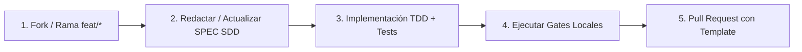

# Guía de Contribución a EvaluaPro

¡Gracias por tu interés en contribuir a **EvaluaPro**! Esta guía detalla el modelo de desarrollo, los estándares de calidad y el flujo obligatorio de trabajo en el repositorio.

---

## 1. Modelo de Repositorio y Gobernanza

- **Núcleo Abierto (*Open Core*):** El núcleo de la plataforma está licenciado bajo [AGPL-3.0-or-later](LICENSE). Los módulos comerciales/institucionales se gestionan bajo acuerdos cerrados.
- **Spec-Driven Development (SDD):** Ningún cambio funcional o de arquitectura se realiza sin redactar o actualizar previamente la especificación técnica correspondiente en `docs/specs/*.spec.md` (ver [`docs/POLITICA_SDD.md`](docs/POLITICA_SDD.md)).
- **Trazabilidad y Calidad Rigurosa:** Todo commit debe mantener la trazabilidad de decisiones en `CHANGELOG.md` y cumplir con el 100% de los gates de integración continua.

---

## 2. Flujo de Trabajo para Contribuir



### Paso 1: Crear una Rama de Trabajo
- Convenciones de ramas:
  - `feat/<nombre-descriptivo>`: Nuevas funcionalidades o mejoras de interfaz.
  - `fix/<nombre-descriptivo>`: Corrección de errores.
  - `docs/<nombre-descriptivo>`: Documentación, especificaciones o guías.

```bash
git checkout -b feat/mi-nueva-mejora
```

### Paso 2: Alineación con Spec-Driven Development (SDD)
Si tu cambio introduce o modifica comportamiento funcional:
1. Crea o actualiza la especificación en `docs/specs/SPEC-XXX_nombre.spec.md`.
2. Define los criterios de aceptación y vincula la matriz de pruebas.
3. Valida la especificación localmente con `npm run sdd:audit`.

### Paso 3: Desarrollo Guiado por Pruebas (TDD)
- Escribe o ajusta las pruebas unitarias e integración en Vitest antes o en paralelo con el código fuente.
- El umbral de cobertura en líneas modificadas (`diff coverage`) debe ser **≥ 90%**.
- No introduzcas exclusiones de cobertura ni stubs vacíos.

### Paso 4: Verificación de Gates Locales Obligatorios
Antes de enviar tu Pull Request, ejecuta la batería de validación en este orden:

```bash
# 1. Linting y Estilo (ESLint 9 Flat Config)
npm run lint

# 2. Tipado Estricto TypeScript
npm run typecheck

# 3. Pruebas de Frontend y Accesibilidad
npm run test:frontend:ci

# 4. Pruebas de Backend y Persistencia SQLite
npm run test:backend:ci

# 5. Pruebas del Portal Alumno Cloud
npm run test:portal:ci

# 6. Cobertura y Cumplimiento TDD
npm run test:coverage:ci
npm run test:tdd:enforcement:ci

# 7. Presupuestos de Rendimiento
npm run perf:check

# 8. Contratos de Pipeline y Auditoría SDD
npm run pipeline:contract:check
npm run ci:policy:audit
```

---

## 3. Guía de Apertura de Pull Requests

1. Asegúrate de que todos los commits sigan el formato **Conventional Commits**:
   - `feat(modulo): descripción clara`
   - `fix(modulo): descripción de la corrección`
   - `docs(spec): actualización de especificación`
2. Abre tu Pull Request completando todos los campos de la plantilla [`.github/pull_request_template.md`](.github/pull_request_template.md).
3. Verifica que los 22 status checks de GitHub Actions concluyan en verde (`success`).

---

## 4. Políticas de Seguridad y Privacidad

- **Privacidad de Datos:** Está estrictamente prohibido subir datos personales reales, credenciales, tokens o respaldos de bases de datos operativas. Usa exclusivamente fixtures anonimizados generados con `npm run test:anon:fixture`.
- **Reporte Responsable de Vulnerabilidades:** No abras issues públicos para reportar vulnerabilidades de seguridad activas. Envía un correo detallado a `armsystechno@gmail.com`.
- Para más información, consulta [`docs/SECURITY_POLICY.md`](docs/SECURITY_POLICY.md) y [`docs/legal/aviso-privacidad-integral.md`](docs/legal/aviso-privacidad-integral.md).
