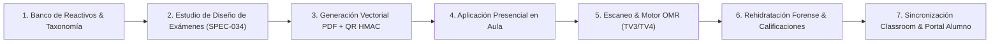

<div align="center">

# EvaluaPro

### Plataforma Universitaria de Evaluación, Calificación OMR y Analítica Académica

[](docs/VERSIONADO.md)
[](LICENSE)
[](docs/ARQUITECTURA_C4.md)
[](https://dtcsrni.github.io/EvaluaPro_Sistema_Universitario/)

<p align="center">
  <strong>EvaluaPro</strong> transforma el ciclo completo de evaluación universitaria en un flujo 100% trazable, repetible y seguro: 
  diseño paramétrico de exámenes, producción de cuadernillos PDF con sellado QR, lectura OMR por visión computacional, 
  rehidratación forense, firmas digitales de encuadre institucional y sincronización offline-cloud.
</p>

</div>

---

## Estado del Sistema y Calidad en CI/CD

| Dimensión | Estado en GitHub Actions |
| :--- | :--- |
| **Pipeline Core** | [](https://github.com/Dtcsrni/EvaluaPro_Sistema_Universitario/actions/workflows/ci.yml) [](https://github.com/Dtcsrni/EvaluaPro_Sistema_Universitario/actions/workflows/ci-policy-audit.yml) |
| **Seguridad y Auditoría** | [](https://github.com/Dtcsrni/EvaluaPro_Sistema_Universitario/actions/workflows/security-codeql.yml) [](https://github.com/Dtcsrni/EvaluaPro_Sistema_Universitario/actions/workflows/ci-antivirus-gate.yml) |
| **Instalador y Empaquetado** | [](https://github.com/Dtcsrni/EvaluaPro_Sistema_Universitario/actions/workflows/ci-installer-windows.yml) [](https://github.com/Dtcsrni/EvaluaPro_Sistema_Universitario/actions/workflows/package.yml) |
| **Módulos de Dominio** | [](https://github.com/Dtcsrni/EvaluaPro_Sistema_Universitario/actions/workflows/ci-backend.yml) [](https://github.com/Dtcsrni/EvaluaPro_Sistema_Universitario/actions/workflows/ci-frontend.yml) [](https://github.com/Dtcsrni/EvaluaPro_Sistema_Universitario/actions/workflows/ci-portal.yml) [](https://github.com/Dtcsrni/EvaluaPro_Sistema_Universitario/actions/workflows/ci-docs.yml) |
| **Gobernanza y Release** | [](https://github.com/Dtcsrni/EvaluaPro_Sistema_Universitario/actions/workflows/release-stable-gate.yml) [](https://github.com/Dtcsrni/EvaluaPro_Sistema_Universitario/actions/workflows/autogen-docs.yml) |

---

## Flujo Operativo Integral



---

## Novedades Principales en la Versión Estable `v1.1.1`

- 🎯 **Estudio de Diseño de Exámenes (`SPEC-034`):** Interfaz unificada en 3 pestañas:
  1. *Diseño y Parámetros:* Variantes A/B/C/D, barajado determinista, balance de dificultad y hoja de respuestas integrada.
  2. *Generación y Lotes:* Generación de cuadernillos con folio único, sellado HMAC-SHA256 y bundle ZIP de recuperación.
  3. *Historial y Métricas:* Monitor de lotes, tasas de descarga y trazabilidad de aplicación.
- ⚡ **Arquitectura Offline-First Nativa:** Base de datos **SQLite embebido con Prisma ORM** en el backend docente, eliminando servicios pesados o dependencias externas para operar de forma 100% autónoma y sin conexión.
- 🎨 **Diseño Visual Bento Elevation & Glassmorphism:** Interfaz renovada con microinteracciones visuales, tarjetas con elevación Bento, tema Prismatic Sapphire y soporte PWA.
- 🛡️ **Encuadre Institucional y Firmas Digitales (`SPEC-040`):** Sellado de temarios, actas de encuadre y libro de calificaciones sanitizado con firma SHA-256.
- 🚀 **Installer Hub para Windows (`SPEC-035`):** Instalador autosuficiente basado en **WiX Toolset v5 Burn con Bootstrapper WPF .NET 8**, gestión de accesos directos vectoriales transparentes y diagnóstico del entorno en 1 clic.

---

## Estructura del Monorepo

```text
EvaluaPro/
├── apps/
│   ├── backend/               # API docente local (Express + TypeScript + Prisma SQLite + OMR)
│   ├── frontend/              # UI docente/alumno (React 18 + Vite + TailwindCSS + Bento)
│   └── portal_alumno_cloud/   # API cloud/PWA para consulta de calificaciones de estudiantes
├── docs/                      # Centro documental, arquitectura C4 y especificaciones SDD
│   ├── specs/                 # 49 especificaciones formales (SPEC-001 a SPEC-049)
│   └── comercial/             # Catálogo de capacidades, modelos de licencia y tiers
├── packaging/                 # WiX Toolset v5 Burn, MSI y Bootstrapper WPF (.NET 8)
├── scripts/                   # Automatizaciones de verificación, migración, pruebas y release
└── site/                      # Landing page pública de GitHub Pages
```

---

## Instalación y Guía de Inicio Rápido

### Para Usuarios Finales y Docentes (Windows)
Descarga el ejecutable oficial desde la sección de **[Releases](https://github.com/Dtcsrni/EvaluaPro_Sistema_Universitario/releases)**:
```text
EvaluaPro-InstallerHub-docente-local-v1.1.1.exe
```
El instalador configura automáticamente los prerequisitos del sistema (Node runtime, SQLite local y accesos directos oficiales) sin configuraciones manuales.

---

### Para Desarrolladores

#### 1. Requisitos Previos
- **Node.js**: versión `24.x` (LTS recomendada).
- **npm**: versión `10.x` o superior.

#### 2. Clonación e Instalación
```bash
git clone https://github.com/Dtcsrni/EvaluaPro_Sistema_Universitario.git
cd EvaluaPro_Sistema_Universitario
npm install
```

#### 3. Ejecución de Servicios en Modo Desarrollo
```bash
# Iniciar API Backend (http://localhost:4000)
npm run dev:backend

# Iniciar UI Frontend (http://localhost:5173)
npm run dev:frontend

# (Opcional) Iniciar Portal Alumno Cloud (http://localhost:8080)
npm run dev:portal
```

---

## Verificación de Calidad y Gates de CI/CD

El repositorio implementa una estricta pirámide de verificación automatizada:

```bash
# 1. Linting y Estilo
npm run lint

# 2. Tipado Estricto TypeScript
npm run typecheck

# 3. Pruebas Unitarias e Integración
npm run test:backend:ci
npm run test:frontend:ci
npm run test:portal:ci

# 4. Cumplimiento TDD y Cobertura
npm run test:coverage:ci
npm run test:tdd:enforcement:ci

# 5. Calidad UX y Regresión Visual
npm run test:ux-quality:ci

# 6. Auditoría de Contrato y Políticas
npm run pipeline:contract:check
npm run ci:policy:audit
```

---

## Licenciamiento y Ediciones

EvaluaPro opera bajo un modelo de **Núcleo Abierto (*Open Core*)**:

- 🌐 **Edición Comunitaria (AGPLv3):** Flujo académico y operativo completo para uso libre de docentes y universidades bajo [LICENSE](LICENSE).
- 🏢 **Ediciones Comercial e Institucional:** Capacidades avanzadas de analítica institucional, SLA garantizado, soporte empresarial y personalización según [docs/comercial/LICENSING_TIERS.md](docs/comercial/LICENSING_TIERS.md).

Para consultas comerciales o implementaciones a gran escala: `armsystechno@gmail.com`.

---

<div align="center">
  <sub>Desarrollado con altos estándares de ingeniería de software, arquitectura limpia y Spec-Driven Development.</sub>
</div>

<!-- AUTO:FEATURES:START -->
## Funciones Confiables por Persona

_Lista auto-sincronizada desde rutas reales del backend + evidencia de pruebas._

| Categoria | Docente | Coordinacion | Institucional | Socio de Canal |
| --- | --- | --- | --- | --- |
| Aplicacion y Captura | 2 | 2 | 2 | 2 |
| Calificacion | 3 | 3 | 3 | 3 |
| Cumplimiento | 0 | 0 | 1 | 1 |
| Gobernanza | 0 | 1 | 1 | 1 |
| Integraciones | 1 | 1 | 1 | 1 |
| Operacion Academica | 2 | 2 | 2 | 2 |
| Operacion Distribuida | 1 | 2 | 2 | 2 |
| Plataforma | 2 | 2 | 2 | 2 |
| Preparacion de Examenes | 2 | 2 | 2 | 2 |
| Seguridad | 1 | 1 | 1 | 1 |

- Totales por persona: Docente: 14 · Coordinacion: 16 · Institucional: 17 · Socio de Canal: 17.
- Catalogo completo: [docs/comercial/FEATURE_CATALOG.md](docs/comercial/FEATURE_CATALOG.md)
<!-- AUTO:FEATURES:END -->

<!-- AUTO:COMMERCIAL-CONTEXT:START -->
## Contexto Comercial y Soporte

- Rol de este documento: Presentacion comercial del producto y decision de compra/licencia.
- Edicion Comunitaria (AGPL): flujo operativo base para uso real.
- Edicion Comercial/Institucional: mas automatizacion, soporte SLA, endurecimiento y hoja de ruta prioritaria por nivel.
- Catalogo dinamico de capacidades: [FEATURE_CATALOG](docs/comercial/FEATURE_CATALOG.md).
- Licenciamiento comercial y modalidades de pago: [LICENSING_TIERS](docs/comercial/LICENSING_TIERS.md).
- Ultima sincronizacion automatica: 2026-08-28.
<!-- AUTO:COMMERCIAL-CONTEXT:END -->
