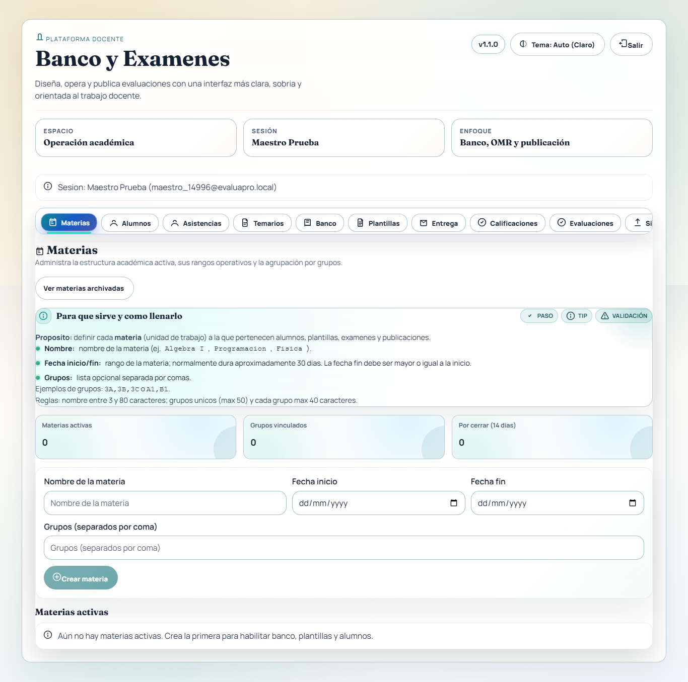
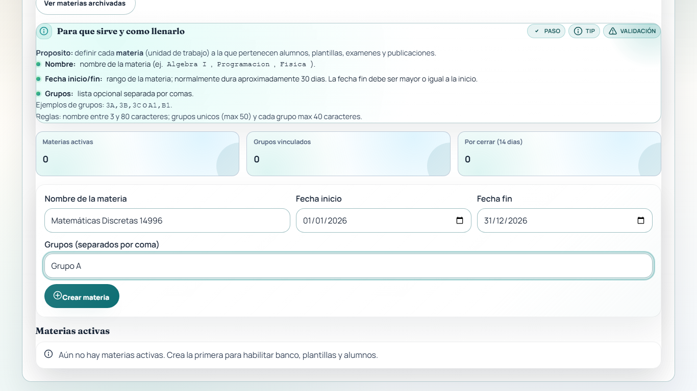
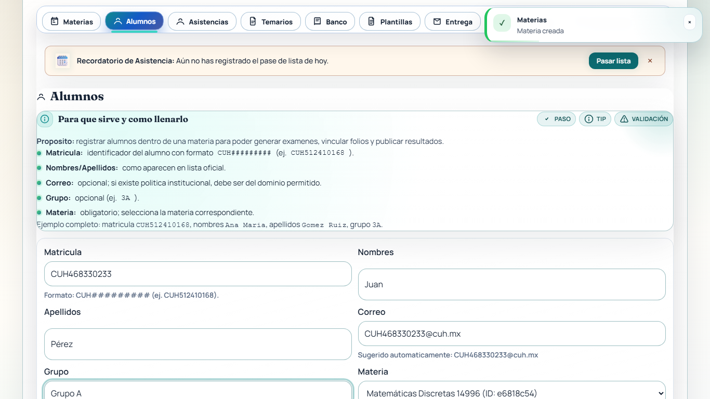

# EvaluaPro - Modernizando la Calificación Universitaria

Presentamos **EvaluaPro**, la suite definitiva diseñada por y para docentes universitarios, creada para automatizar la corrección de exámenes a través del reconocimiento de marcas ópticas (OMR), permitiéndote recuperar tu tiempo y enfocarte en lo que realmente importa: la educación.

## 🚀 Una Experiencia Moderna y Fluida

La plataforma web de EvaluaPro ha sido construida con una interfaz amigable, de diseño limpio y receptivo.

Al ingresar, tienes control total e instantáneo sobre tus periodos activos, asistencia, y analíticas de evaluación de un solo vistazo.

## 📚 Gestión Simplificada de Periodos y Materias

Crear una nueva asignatura no toma más de unos segundos. EvaluaPro maneja de forma inteligente la segmentación de tu semestre y grupos, permitiéndote agrupar a tus alumnos sin fricción organizativa.

## 👥 Control Absoluto del Estudiantado

Nuestra potente tabla de gestión de estudiantes te permite ver y filtrar instantáneamente las matrículas, materias, y progreso en base a evaluaciones. La captura manual de estudiantes es sencilla y clara, aunque también ofrecemos integración directa para cargas masivas.

Todo vinculado nativamente para que el motor OMR sepa identificar a quién le pertenece cada examen calificado.

---

**Comienza a optimizar tu flujo de trabajo docente hoy mismo.**

EvaluaPro — *Evaluación ágil, resultados inmediatos.*
