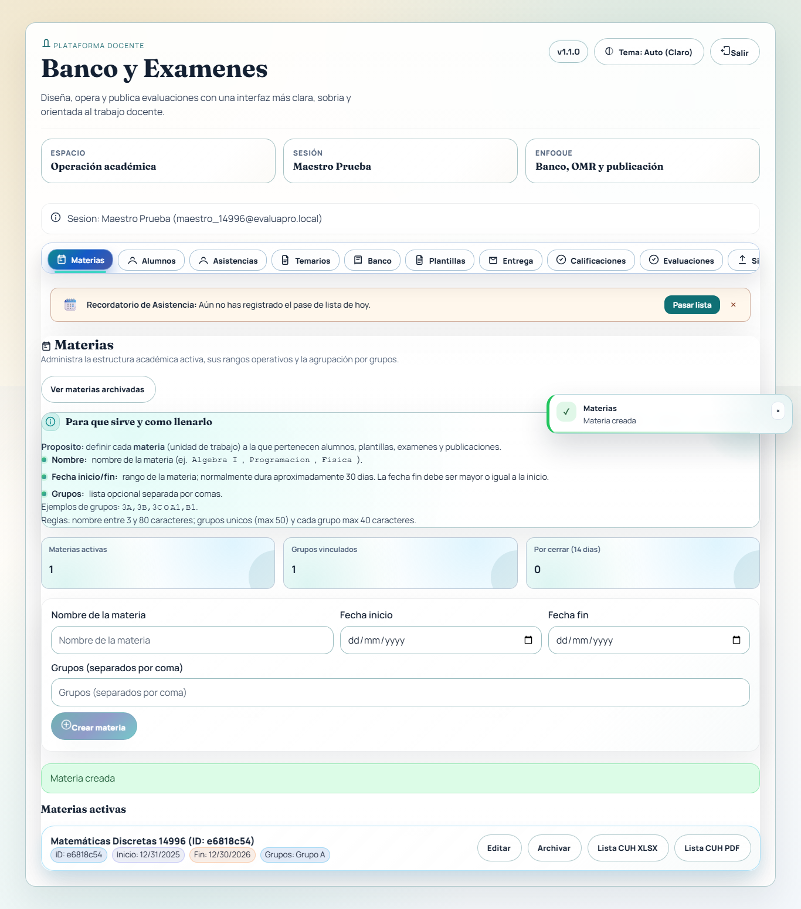
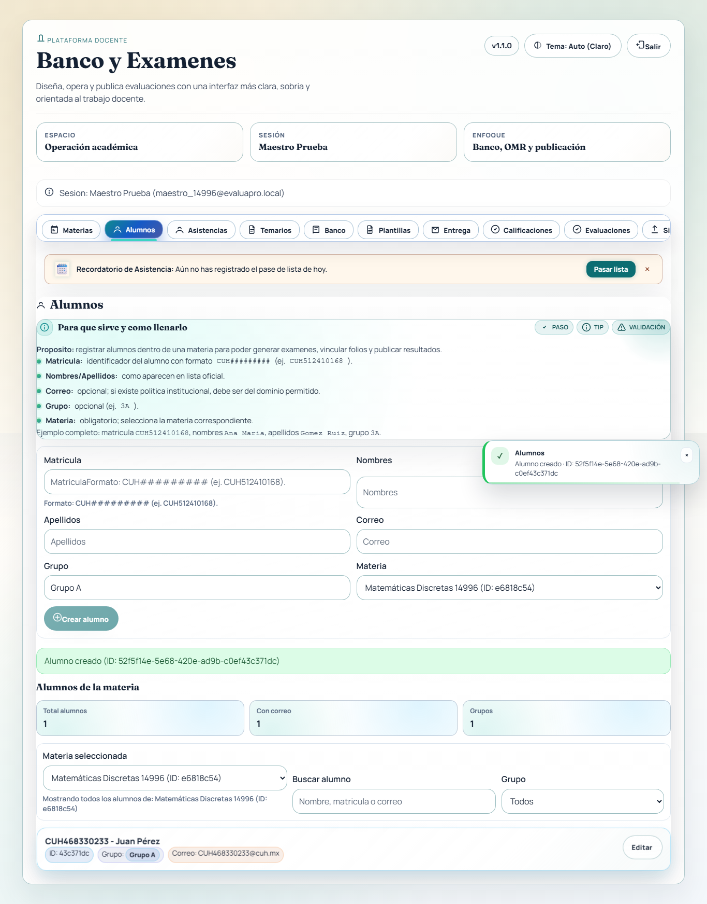

# Manual de Usuario Docente - EvaluaPro

Bienvenido a **EvaluaPro Sistema Universitario**, tu plataforma integral para la gestión y evaluación de alumnos mediante tecnología OMR. En este manual rápido te explicaremos cómo configurar tu primer ciclo escolar y registrar a tus primeros estudiantes.

---

## 1. El Escritorio Principal (Dashboard)

Una vez que inicias sesión por primera vez, serás recibido por tu **Escritorio**. Aquí tendrás una vista rápida de tus periodos activos, estadísticas de exámenes y atajos a las funciones más utilizadas.

> **Tip:** El panel lateral izquierdo siempre te permitirá navegar entre Periodos, Exámenes, Banco de Preguntas y Analíticas.

---

## 2. Creando tu Primer Periodo / Materia

Para poder evaluar, primero debes crear la materia que impartes (Periodo Escolar). En el panel lateral, dirígete a **Periodos** y haz clic en el botón superior derecho **Crear materia**.

Se desplegará el siguiente formulario:

Completa los campos:
- **Nombre de la materia:** Ej. Matemáticas Discretas.
- **Fecha inicio y fin:** Delimita el semestre escolar.
- **Grupos:** Opcionalmente registra el identificador de los grupos (Ej. Grupo A).

Al confirmar, la materia aparecerá listada en tus Periodos Activos:

---

## 3. Registro de Alumnos

Una vez creada tu materia, navega al apartado de **Alumnos** desde el menú lateral. En esta sección podrás dar de alta a tus estudiantes para vincularlos con sus hojas de respuestas OMR.

Haz clic en **Crear alumno** y llena su información:

Asegúrate de:
- Escribir correctamente la **Matrícula** (es clave para el escaneo OMR automático).
- Asignarlo a la **Materia** que acabas de crear usando el selector.

Al finalizar, verás tu lista de estudiantes poblada y lista para ser evaluada:

¡Y listo! Con esto ya tienes tu entorno configurado para crear tu primera plantilla de examen y comenzar a procesar calificaciones masivas.
